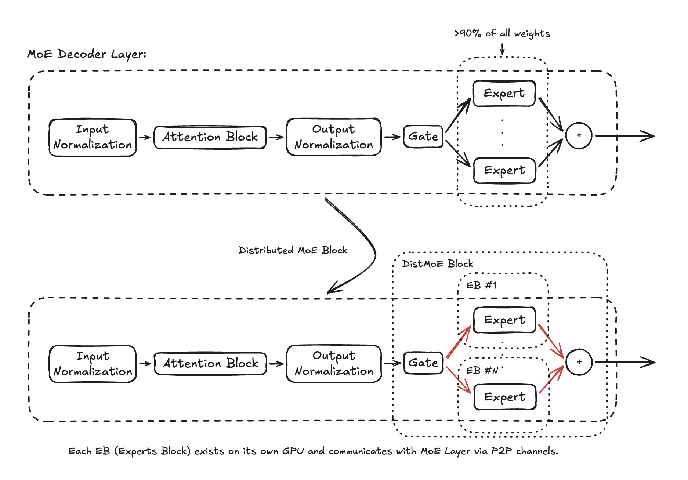
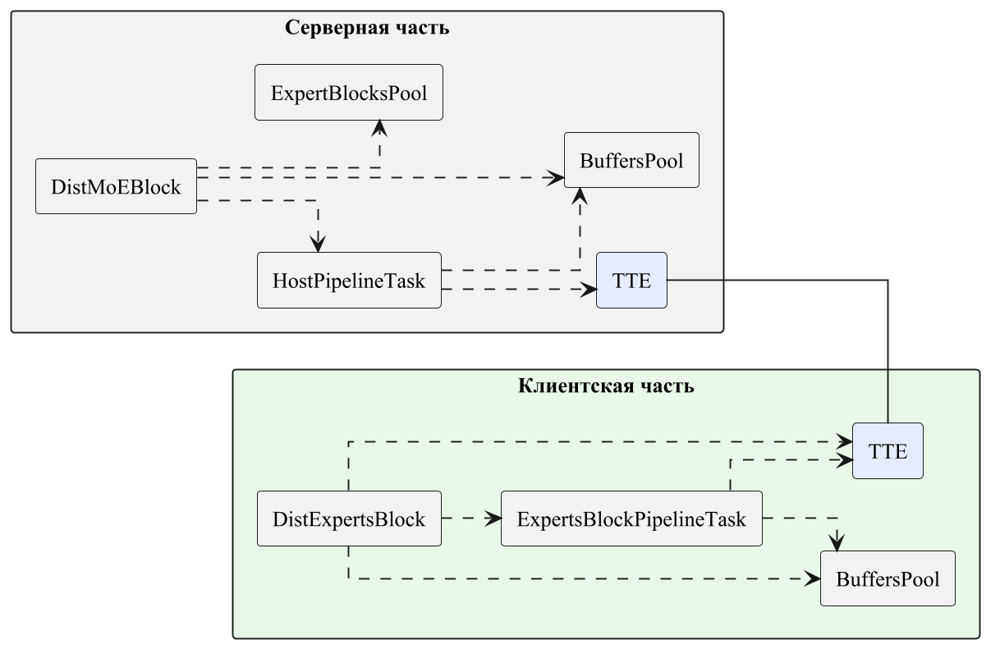
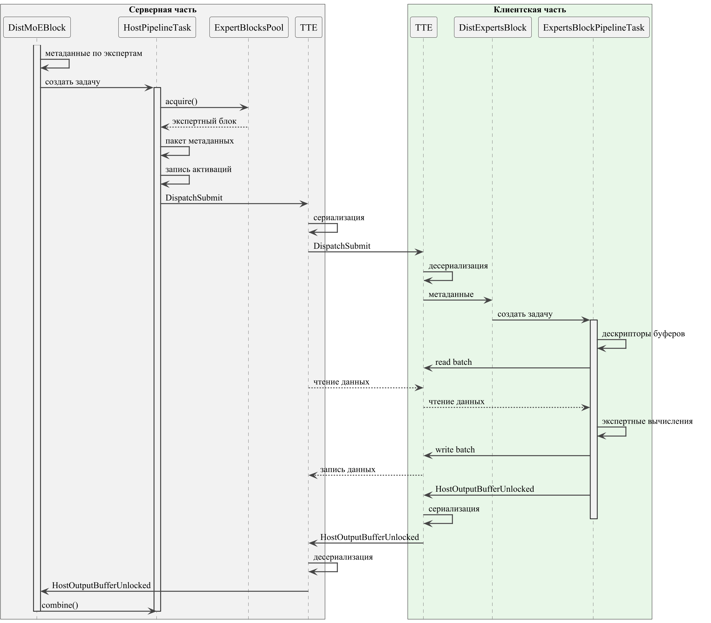
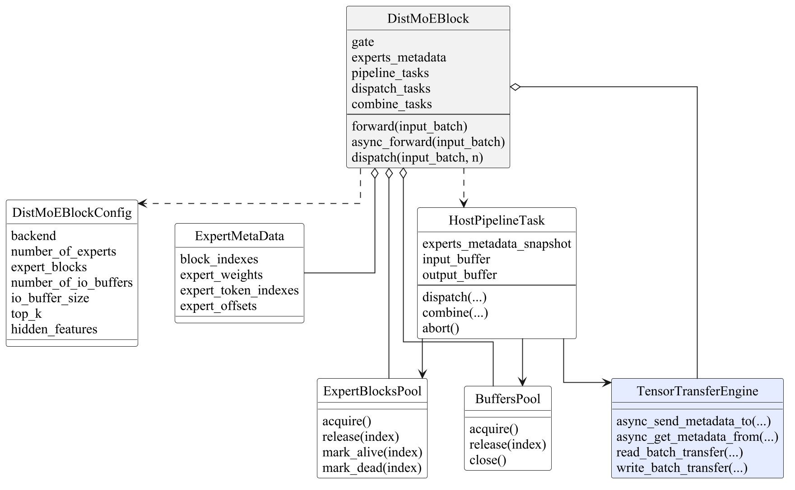
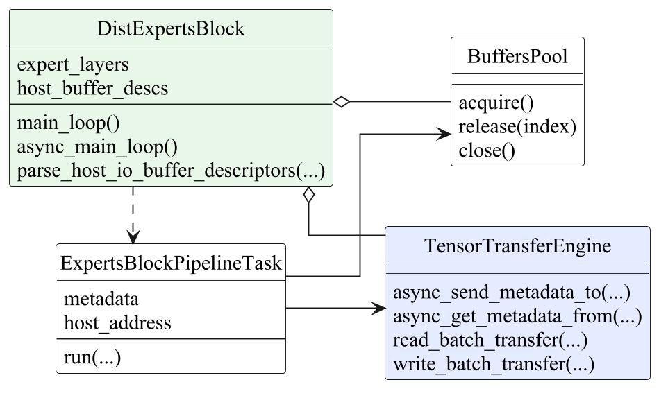
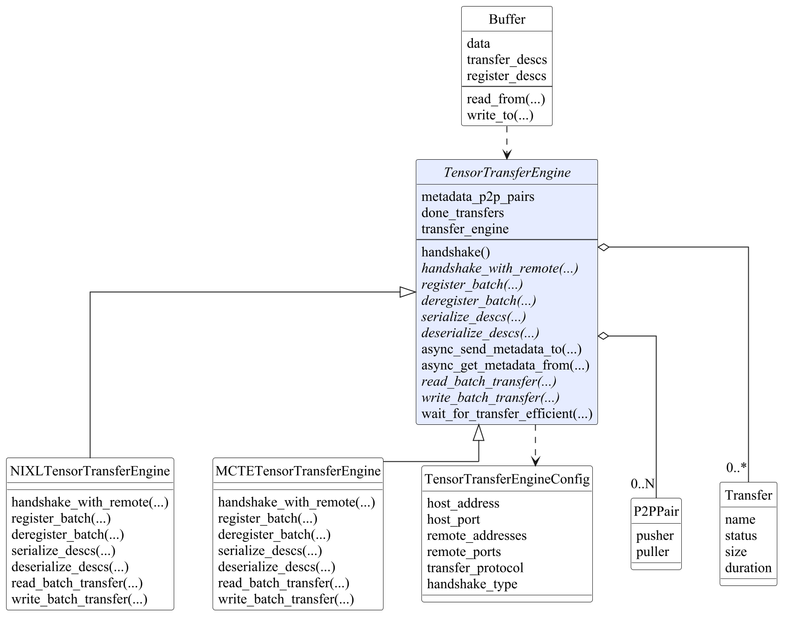
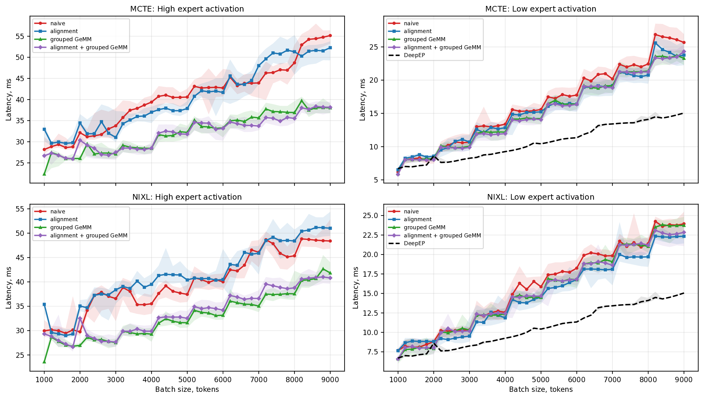
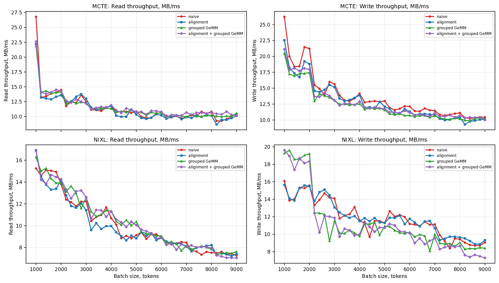
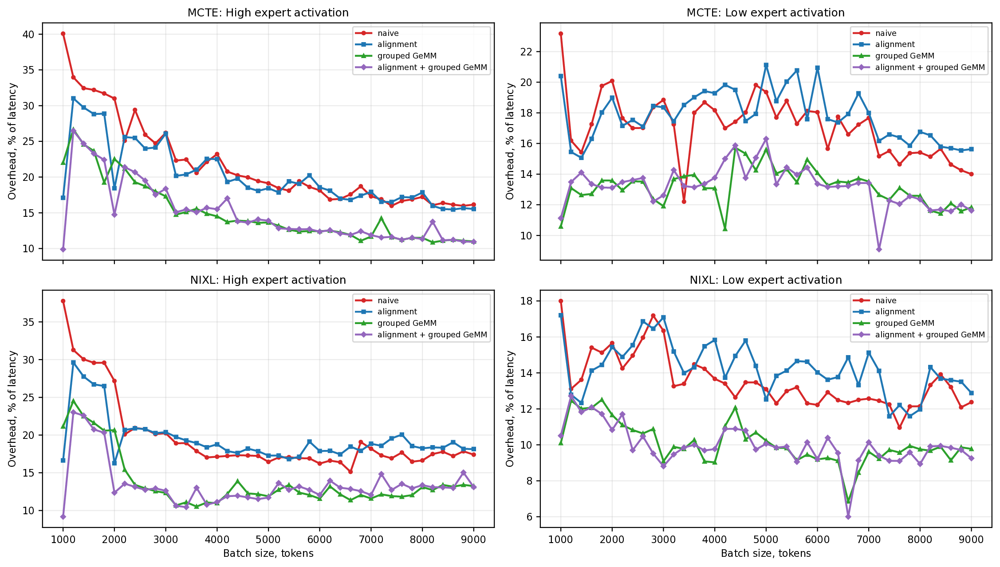
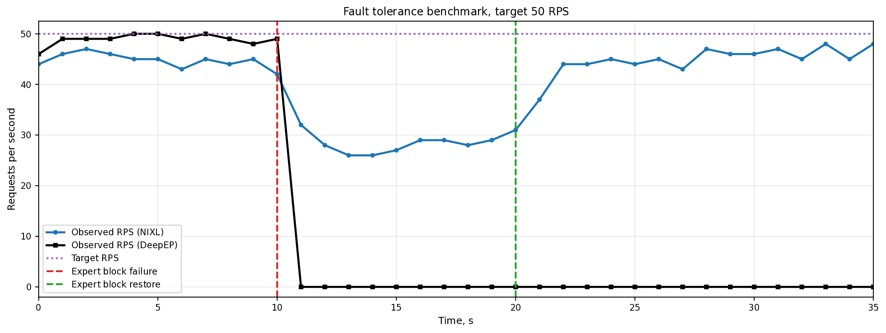

<h1 align="center">DistributedMoE</h1>

<p align="center">
  <strong>Отказоустойчивый инференс Large Scale MoE моделей</strong>
</p>

<p align="center">
  <a href="https://www.python.org/"></a>
  <a href="https://pytorch.org/"></a>
  
  
  
</p>

DistributedMoE - исследовательский прототип отказоустойчивого инференса
MoE-моделей. Проект заменяет классическую коллективную схему экспертного
параллелизма на основе `All-to-All` на асинхронную клиент-серверную
архитектуру: основной MoE-блок выбирает доступный экспертный блок во время
работы, передает активации через tensor transfer engine и объединяет результаты
без участия всей коллективной группы.

Проект разработан в рамках выпускной квалификационной работы. Текст диплома
находится в
[`docs/diploma/bachelor-thesis-template/parts`](docs/diploma/bachelor-thesis-template/parts),
готовый PDF - [`sikuralenok_diploma.pdf`](sikuralenok_diploma.pdf).

<p align="center">
  
</p>

## Зачем это нужно

Большие MoE-модели увеличивают число параметров за счет множества экспертов, но
для каждого токена активируют только небольшое подмножество из них. При
распределенном инференсе эксперты размещаются на разных GPU, а этап
dispatch/combine обычно реализуется через коллективные коммуникации. Такие
решения очень быстры, пока все участники исправны, но один медленный или
недоступный ранг может остановить весь шаг инференса.

Основная цель работы - предложить и разработать рабочий прототип
альтернативного подхода к инференсу больших языковых моделей, основанных на
архитектуре MoE, удовлетворяющий требованиям динамической балансировки нагрузки
и обеспечивающий более высокую отказоустойчивость по сравнению с оригинальным
подходом, основанным на коллективах.

Гипотеза работы заключается в том, что замена коллективных `All-to-All`
коммуникаций на уровне экспертного слоя в MoE-моделях на клиент-серверное
взаимодействие между основной частью модели и экспертными блоками позволяет
выбирать конкретного исполнителя во время работы системы, перераспределять
нагрузку между репликами экспертов и сохранять доступность при отказе части
экспертных блоков.

## Архитектура

<p align="center">
  
</p>

<p align="center">
  <em>Основные компоненты метода: серверный MoE-блок, экспертные блоки, пулы буферов и TensorTransferEngine.</em>
</p>

<p align="center">
  
</p>

<p align="center">
  <em>Один цикл dispatch/combine: выбор экспертного блока, передача активаций, выполнение экспертов и возврат результата.</em>
</p>

### Основные компоненты

| Компонент | Роль |
| --- | --- |
| `DistMoEBlock` | Серверная часть MoE-слоя: роутинг, создание dispatch-задач, выбор экспертных блоков, прием уведомлений и combine. |
| `DistExpertsBlock` | Клиентская часть: хранит локальные веса экспертов, читает активации, выполняет expert MLP, записывает результат обратно. |
| `TensorTransferEngine` | Общая абстракция для высокопроизводительной передачи тензоров; реализована поверх NIXL и MoonCake Transfer Engine. |
| `BuffersPool` | Пул заранее зарегистрированных входных и выходных буферов, уменьшающий стоимость повторной регистрации памяти. |
| `ExpertBlocksPool` | Отслеживает живые и недоступные экспертные блоки, помогает выбирать исполнителя для dispatch. |
| `PipelineTask` | Абстракция жизненного цикла dispatch/combine на стороне хоста и выполнения задачи на стороне эксперта. |
| `MetricsCollector` | Иерархический сбор метрик: forward pass, dispatch, combine, expert run и throughput передач. |

Управляющий контур использует P2P-сообщения с метаданными, а контур данных
перемещает GPU-буферы через NIXL или MoonCake. Благодаря этому планирование
остается явным и управляемым, а сами активации и результаты передаются через
специализированные механизмы адресной передачи памяти.

<details>
<summary>UML-диаграммы ключевых классов</summary>

<p align="center">
  
</p>

<p align="center">
  
</p>

<p align="center">
  
</p>

</details>

## Структура репозитория

```text
.
├── src/python/MoE
│   ├── DistMoEBlock.py              # оркестрация MoE на стороне хоста
│   ├── DistExpertsBlock.py          # runtime удаленного экспертного блока
│   ├── PipelineTask.py              # жизненный цикл host/expert задач
│   ├── MetricsCollector.py          # сбор и экспорт метрик
│   ├── benchmarks                   # performance и fault-tolerance бенчмарки
│   └── tests                        # интеграционные тесты MoE
├── src/python/TensorTransferEngine
│   ├── TensorTransferEngine.py      # backend-independent интерфейс
│   ├── NIXLTensorTransferEngine.py  # backend NVIDIA NIXL
│   ├── MCTETensorTransferEngine.py  # backend MoonCake Transfer Engine
│   └── tests                        # тесты движков передачи
├── docs
│   ├── general.md                   # описание архитектуры
│   ├── metrics_evaluation.md        # документация по метрикам
│   ├── images                       # схемы для документации
│   └── diploma                      # исходники и PDF диплома
├── src/scripts                      # запуск тестов и экспериментов
├── dockerfile                       # CUDA/NIXL/MoonCake/DeepEP окружение
├── requirements.txt
└── project_report.txt
```

## Требования

Полная версия проекта рассчитана на GPU-сервер, а не на локальный CPU-only
запуск.

- NVIDIA GPU с поддержкой CUDA.
- CUDA 12.x.
- PyTorch с CUDA.
- InfiniBand/RDMA для `rdma` экспериментов или NVLink для `nvlink`.
- Docker и NVIDIA Container Toolkit для рекомендуемого окружения.
- NIXL, MoonCake Transfer Engine, UCX, ZeroMQ и DeepEP для полного набора
  бенчмарков.

[`dockerfile`](dockerfile) собирает исследовательское окружение с CUDA,
MoonCake, NIXL, UCX, DeepEP, PyTorch, зависимостями для бенчмарков и
диагностическими утилитами.

## Быстрый старт

### 1. Собрать Docker-образ

```bash
docker build --network=host -f dockerfile -t distributed-moe .
```

Скрипт [`run_docker.sh`](run_docker.sh) тоже умеет собирать и запускать
контейнер, но содержит машинно-специфичные Docker-тома и пути. Перед запуском
на другом хосте его стоит адаптировать.

### 2. Запустить GPU-контейнер

```bash
docker run --rm -it \
  --privileged=true \
  --network=host \
  --security-opt seccomp=docker_profile.json \
  --gpus all \
  --shm-size=32g \
  --ulimit memlock=-1 \
  --ipc=host \
  -v "$PWD/src:/MCTE/src" \
  --name distributed-moe \
  distributed-moe \
  /bin/bash
```

Для сохраненных в репозитории helper-скриптов ожидаемый путь проекта внутри
контейнера - `/MCTE`. Монтируйте `src` отдельно: если примонтировать весь
репозиторий поверх `/MCTE`, можно скрыть собранные внутри образа зависимости из
`/MCTE/.local`.

### 3. Перейти в Python-пакеты

```bash
cd /MCTE/src/python
export PYTHONPATH=/MCTE/src/python
```

## Тесты

Интеграционный тест MoE требует две видимые GPU и выбранный backend передачи:

```bash
MC_LOG_LEVEL=WARNING python3 -m MoE.tests.dist_moe_test \
  --backend=nixl \
  --precision=fp16 \
  --gpu_id_host=0 \
  --gpu_id_remote=1 \
  -s
```

Тесты tensor transfer engine можно запускать напрямую:

```bash
python3 -m TensorTransferEngine.tests.tte_nixl_test \
  --gpu_id_host=0 \
  --gpu_id_remote=1 \
  -s

python3 -m TensorTransferEngine.tests.tte_mcte_test \
  --gpu_id_host=0 \
  --gpu_id_remote=1 \
  -s
```

Удобные обертки находятся в [`src/scripts`](src/scripts). Часть из них
настроена под исходную контейнерную структуру `/MCTE`, фиксированные GPU ID и
диапазоны портов, поэтому их лучше воспринимать как воспроизводимые скрипты
экспериментов, а не как полностью переносимый CLI.

## Бенчмарки

### Comprehensive MoE Benchmark

Запускает эксперименты по latency, throughput, overhead, alignment и grouped
GEMM:

```bash
bash /MCTE/src/scripts/run_comprehensive_benchmark.sh nixl fp16 0 1 rdma
```

То же самое можно вызвать как Python-модуль:

```bash
python3 -m MoE.benchmarks.comprehensive_benchmark \
  --backend=nixl \
  --host_device=cuda:0 \
  --remote_device=cuda:1 \
  --dtype=fp16 \
  --transfer_protocol=rdma \
  --warmup_runs=16 \
  --perf_runs=32 \
  --batch_sizes=1000,2000,4000,8000
```

### DeepEP Baseline

Полный runner умеет запускать DistributedMoE, DeepEP или оба варианта:

```bash
bash /MCTE/src/scripts/run_full_benchmark_with_deepep.sh \
  nixl bf16 0 1 rdma \
  --bench-dist-moe \
  --bench-deep-ep
```

### Fault-Tolerance Benchmark

Бенчмарк поднимает два экспертных блока, временно отключает один из них и
измеряет пропускную способность во времени:

```bash
bash /MCTE/src/scripts/run_fault_tolerance_benchmark.sh \
  nixl fp16 0 1 2 rdma 50.0 30
```

Результаты сохраняются в:

```text
src/python/MoE/benchmarks/data/
```

Графики из диплома сгенерированы из той же серии экспериментов и лежат в
[`docs/diploma/bachelor-thesis-template/diagrams/experiments`](docs/diploma/bachelor-thesis-template/diagrams/experiments).

## Результаты экспериментов

### Latency comparison

<p align="center">
  
</p>

Grouped GEMM сильнее всего помогает в сценарии с большим числом активных
экспертов: вместо множества мелких матричных умножений система запускает более
крупные grouped-операции. При малом числе активных экспертов абсолютная
задержка ниже, а различия между конфигурациями становятся менее выраженными.

### Transfer throughput

<p align="center">
  
</p>

С ростом batch size отдельные операции чтения и записи конкурируют за общий
канал передачи данных: средняя пропускная способность одной операции может
снижаться, но суммарная загрузка коммуникационного слоя растет.

### Overhead analysis

<p align="center">
  
</p>

Накладные расходы отражают цену клиент-серверного подхода: сериализацию
метаданных, планирование задач, ожидание буферов и асинхронную координацию.
При этом рост overhead остается контролируемым при увеличении размера батча.

### Fault tolerance

<p align="center">
  
</p>

При отказе одного экспертного блока DistributedMoE продолжает обрабатывать
запросы на оставшемся исполнителе, а после добавления нового блока восстанавливает
пропускную способность. Для коллективного подхода отказ ранга приводит к
остановке dispatch/combine и падению throughput до нуля.

## Экспериментальный стенд

В дипломных экспериментах использовалась следующая конфигурация:

| Параметр | Значение |
| --- | --- |
| GPU | 8 x NVIDIA H100 |
| Видеопамять | 80 GB |
| Связь между GPU | InfiniBand |
| MoE-конфигурация | 128 экспертов, `top_k = 8` |
| Hidden size | 2048 |
| Expert intermediate size | 6144 |
| Sequence length | 200 для latency experiments, 8192 context в fault-tolerance benchmark |
| Прогоны | 16 warmup + 32 measured runs для основного latency benchmark |

Главный качественный результат - осознанный системный компромисс:
DistributedMoE уступает оптимизированным коллективам по пиковой
производительности, но продолжает инференс при исчезновении экспертного блока и
восстанавливает пропускную способность после добавления нового исполнителя.

## Цитирование

Если вы используете репозиторий как исследовательский артефакт, можно сослаться
на него так:

```bibtex
@misc{distributedmoe2026,
  title  = {Fault-Tolerant Inference of Large Scale MoE models},
  author = {Sviatoslav I. Kuralenok},
  year   = {2026},
  note   = {Bachelor thesis research prototype}
}
```
