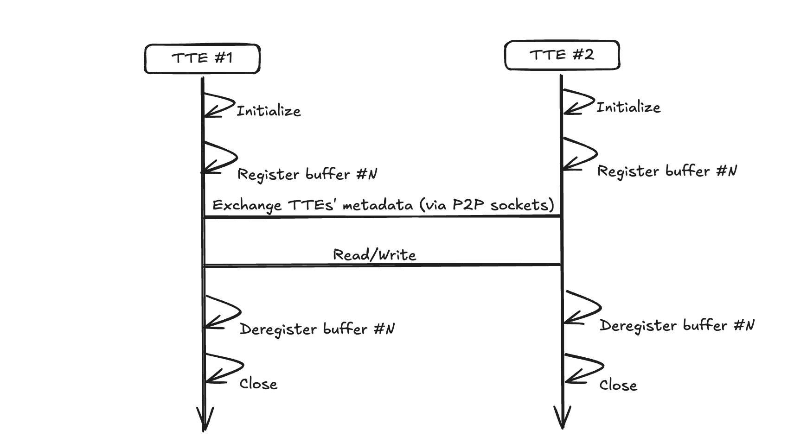
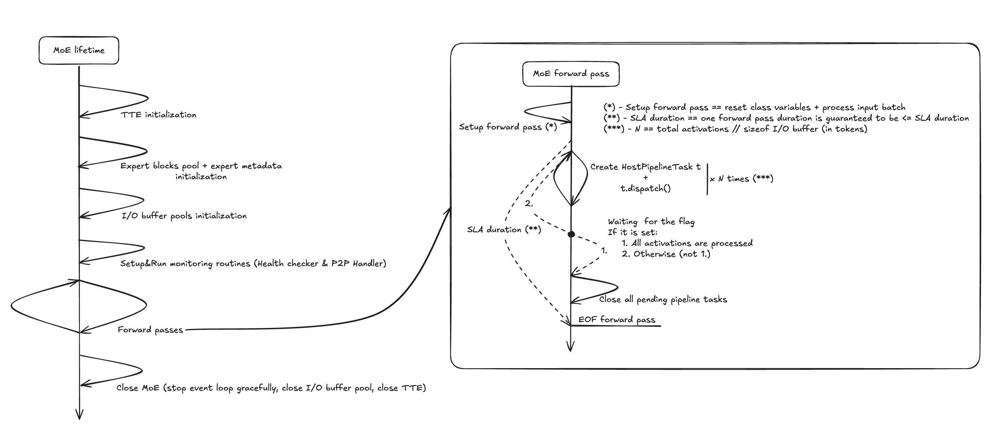
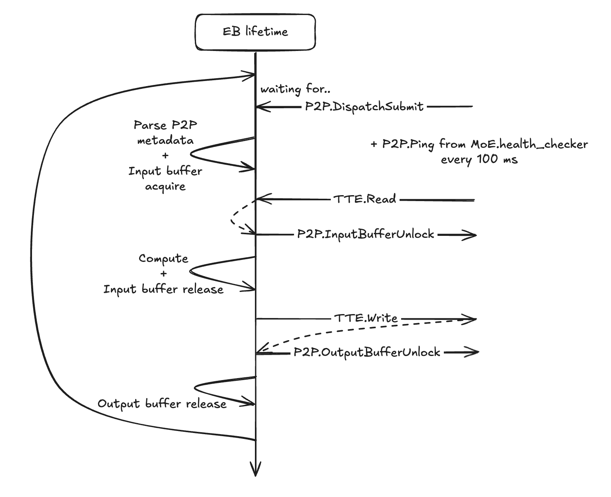
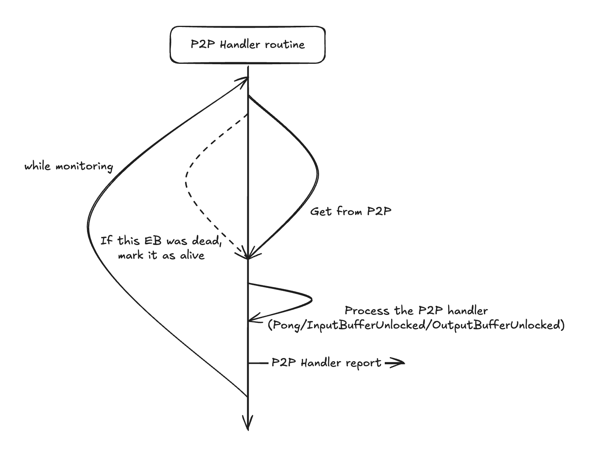
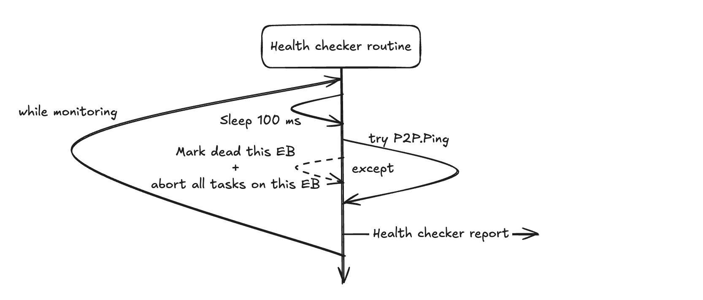

# System Architecture Overview

## General idea/conception

## Main components

### Expert Block (EB)
An Expert Block contains the weights of the experts that are located in that block and provides an endless loop of:
- Get & parse dispatch metadata
- Reading data from host to get the necessary activations
- Compute expert layers
- Writing the compute result into the host data for further aggregation

### MoE Block (MoE)
The Mixture of Experts block (there is only a host part, without any expert weights). \
This object orchestrates the whole pipeline: input batch becomes activations per expert, then there are many dispatches of these activations to their EB, then combine by the response from the EBs.

Also, there are 2 asynchronous monitor tasks:
- **Health Checker**: for validating that the EBs are alive/dead
- **P2P Handler**: for processing P2P messages

## Common Components

### Tensor Transfer Engine (TTE)
Provides a P2P communication API between MoE-EBs and data transfers between buffers (from GPU/CPU to GPU/CPU via IB/NVLink) based on MoonCake Transfer Engine or NVIDIA NIXL. \
Important notice: all data transfers are asynchronous by the default, also P2P communication has 2 variants: synchronous and asynchronous (the last option is used in the MoE and EB realizations due to the I/O non-blocking requirement).

### Buffers Pool
A pool of the registered buffers which can be transferred by the TTE. \
A buffer itself is data (FP32/FP16/FP8/INT8), register descriptors, transfer descriptors, and serialized transfer descriptors (for better performance).

**Usage:**
- In the MoE/EB there are 2 pools, for the input and output buffers.
- It is essential to provide multiple channels for data transfers (to improve memory throughput), so the pool model seems to be quite effective.

### Pipeline Tasks
An abstraction that contains: TTE's link, I/O buffer pools, and a close method (that releases all acquired I/O buffers if there are any).

- **For the MoE**: there is a `HostPipelineTask` that additionally has dispatch/combine/abort methods.
- **For the EB**: there is an `ExpertBlockPipelineTask` that additionally has a run method.

### Expert Blocks Pool
A pool of the expert blocks.
This pool is crucial for the `HostPipelineTask.dispatch()` method - the dispatch process is designed to be dumb & greedy:
while forwarding, the MoE block is creating many `HostPipelineTask` objects and instantly calling `.dispatch()` (wrapped into the asyncio asynchronous task). Therefore, in order to overlap data transfers, we should be picking a different EB for each dispatch call, so, the pool structure seems to be pretty effective once again (+ due to fault-tolerance considerations, this approach has its own benefits).

## MoE and EB lifetimes

The system components follow specific lifecycle patterns that are crucial for understanding the overall architecture:

**MoE Block Lifetime:**

**Expert Block Lifetime:**

<!--  -->

## Monitoring Processes

### P2P Handler
Centralized P2P handling in the MoE block for each of the EBs as a remote (centralized is essential due to the asynchronous nature of the MoE forward pass).

While monitoring: waiting with some timeout (3s) for the P2P message, then there is a 'switch' for each of the P2P headers that can appear on the MoE block.

<!--  -->

### Health Checker
A monitor for the alive/dead EB. There is one health check for each of the EBs.

Every 100 ms we should check whether the EB is alive or not, because we cannot dispatch an expert's activations to a dead EB.

Also, if there are some pipeline tasks which have already been dispatched to the dead EB, we should abort all of them (via the `.abort()` method).

Currently, the health checker is communicating with the EB via P2P, so it is very connected to the P2P Handler.

<!--  -->
